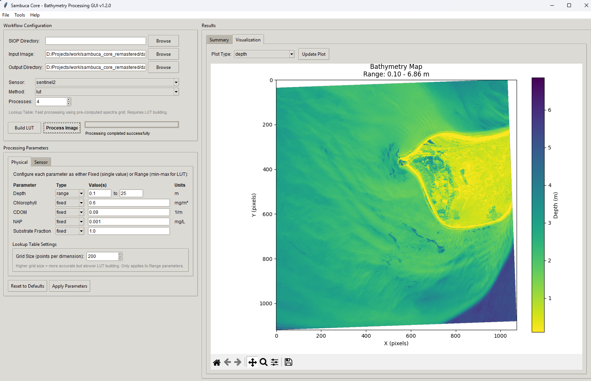

# Sambuca GUI

Graphical User Interface for sambuca_core bio-optical modeling.



## Overview

Sambuca GUI provides an easy-to-use interface for the sambuca_core package, enabling users to perform semi-analytical bio-optical modeling of aquatic reflectance spectra through a comprehensive graphical interface.

## Features

- **Parameter Configuration**: Flexible parameter setup with fixed/range selection for LUT building
- **Sensor Support**: Built-in support for Sentinel-2 and Landsat-8 band configurations  
- **Image Processing**: Support for various satellite image formats with rasterio
- **Lookup Table Methods**: Fast LUT-based inversion with configurable grid resolution
- **Real-time Visualization**: Interactive plotting and results display in the Results panel
- **Progress Tracking**: Real-time progress bars for LUT building and image processing
- **Export Options**: Save results as NumPy arrays, with future support for GeoTIFF exports

## Installation

### Prerequisites

**Important**: You must install sambuca_core before using this GUI, as it provides the core bio-optical modeling functionality.

```bash
# First, install sambuca_core from source
git clone https://github.com/lmschwenger/sambuca_core.git
cd sambuca_core
pip install .
```

### Install Sambuca GUI

```bash
# Clone and install sambuca_gui
git clone https://github.com/lmschwenger/sambuca_gui.git
cd sambuca_gui
pip install .
```

### Optional Dependencies

For full functionality, also install:
```bash
pip install rasterio matplotlib seaborn  # For image loading and visualization
```

## Quick Start

### GUI Mode
```bash
# Launch the graphical interface
python -m sambuca.gui.main

# Or if installed as package
sambuca-gui
```

### Check Dependencies
```bash
# Verify all dependencies are installed
python -m sambuca.gui.main --check-deps
```

### Command Line Mode
```bash
# Process an image from command line
python -m sambuca.gui.main --cli -i image.tif -o results/ --method lut --sensor sentinel2
```

## Usage

1. **Configure Parameters**: 
   - Use the Physical tab to set parameter ranges (for LUT building) or fixed values
   - Configure sensor settings in the Sensor tab
   - Click "Apply Parameters" to update the workflow

2. **Select Files**:
   - Choose input image file (supports TIFF, etc. via rasterio)
   - Set output directory for results
   - Optionally specify custom SIOP directory

3. **Process**:
   - Build LUT (if using LUT method) - shows progress and estimated entries
   - Click "Process Image" to start bathymetry retrieval
   - Monitor progress in real-time

4. **View Results**:
   - Check the Results panel for processing outputs
   - View parameter maps (chlorophyll, CDOM, NAP, depth)
   - Results are saved as .npy files in the output directory

## Requirements

- Python >= 3.8
- sambuca_core >= 1.0.0 (required - install from source)
- tkinter (usually bundled with Python)
- numpy >= 1.20.0
- pathlib (standard library)

### Optional Dependencies
- rasterio >= 1.2.0 (for image loading)
- matplotlib >= 3.4.0 (for visualization)

## Configuration

The GUI supports flexible parameter configuration:

- **Range Parameters**: Used for LUT building (e.g., depth: 0.1-25.0 m)
- **Fixed Parameters**: Single values used throughout processing
- **LUT Grid Size**: Controls lookup table resolution (10-100 points per dimension)
- **Sensor Configuration**: Band selection and wavelength mapping

## Troubleshooting

### Common Issues

1. **"sambuca_core not available"**: 
   - Ensure sambuca_core is installed from source as shown above
   - Check that SIOP data files are included in the installation

2. **Image loading errors**:
   - Install rasterio: `pip install rasterio`
   - Ensure image file format is supported (TIFF recommended)

3. **Memory issues with large LUTs**:
   - Reduce grid size in Physical parameters
   - Use fewer range parameters (more fixed parameters)

## License

MIT License

## Related Projects

- [sambuca_core](https://github.com/lmschwenger/sambuca_core) - Core bio-optical modeling engine

## Citation

If you use this software in your research, please cite:

```
Schwenger, L.M. (2024). Sambuca GUI: Graphical User Interface for Semi-Analytical 
Bio-Optical Modeling. https://github.com/lmschwenger/sambuca_gui
```